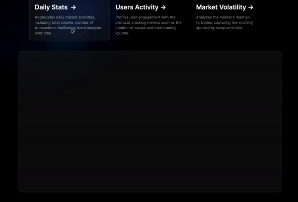

# Next.js Frontend for Uniswap V3 Analytics



## Overview

This Next.js frontend application leverages The Graph Client to query data from the Uniswap V3 Analytics Subgraph. Designed to provide insightful analysis of Ethereum and USDC pair activities on Uniswap V3, it features real-time data visualization of market trends and user activities.
## Features

- **Real-Time Analytics**: Explore up-to-date statistics on ETH-USDC swaps, liquidity, and market volatility.
- **User Activity Insights**: Analyze activities of individual users, tracking their transactions and contributions to liquidity pools.
- **Market Trends Visualization**: Interactive charts and graphs detailing daily market stats and volatility.
- **Responsive UI**: A modern, responsive design ensuring a seamless experience across all devices.

## Setup

### Prerequisites

- Node.js installed (version 12.x or later)
- Yarn or npm for managing packages

### Steps

1. **Clone the project repository**

```bash
git clone https://github.com/marcusats/pools-visualizer.git
cd your-frontend-repo
```


2. **Install dependencies**

```bash
yarn install
# or
npm install
```

3. **Configure The Graph Client**

```yaml
sources: 
  - name: uniswap-eth-usdc-analyzer
    handler: 
      graphql:
        endpoint: https://api.thegraph.com/subgraphs/name/marcusats/uniswap-eth-usdc-analyzer
documents:
  - ./src/utils/graphql/GetDailyStats.gql
  - ./src/utils/graphql/GetUserActivity.gql
  - ./src/utils/graphql/GetMarketVolatility.gql
```